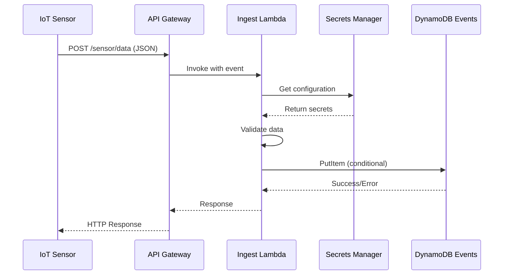
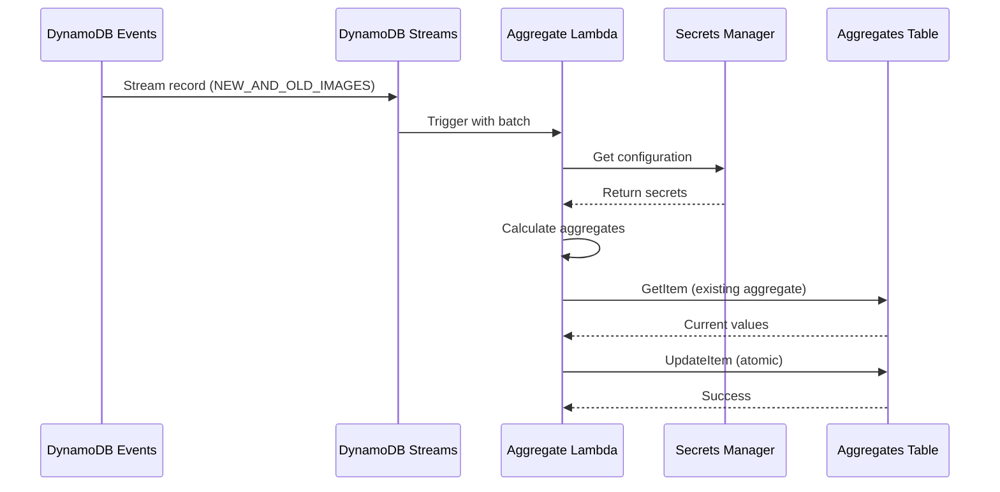
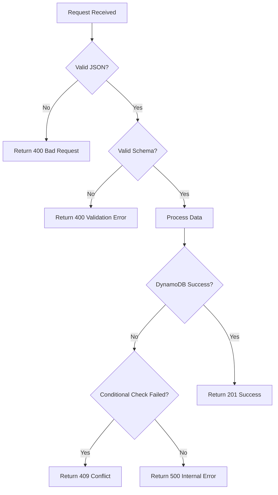

# IoT Sensor Aggregator - Architecture Documentation

This document provides a comprehensive overview of the IoT Sensor Aggregator architecture, designed following AWS best practices and the Well-Architected Framework.

## 📋 Table of Contents

1. [Architecture Overview](#architecture-overview)
2. [AWS Well-Architected Implementation](#aws-well-architected-implementation)
3. [Component Details](#component-details)
4. [Data Flow](#data-flow)
5. [Security Implementation](#security-implementation)
6. [Best Practices Applied](#best-practices-applied)
7. [Monitoring & Observability](#monitoring--observability)
8. [Cost Optimization](#cost-optimization)

## 🏗️ Architecture Overview

The IoT Sensor Aggregator is a **serverless, event-driven architecture** built on AWS that ingests sensor data via REST API and performs real-time aggregation using DynamoDB Streams.

### 📊 Architecture Diagrams

Three comprehensive diagrams have been created to illustrate different aspects of the architecture:

1. **`iot-sensor-aggregator-architecture.png`** - High-level system overview
2. **`iot-sensor-aggregator-detailed-flow.png`** - Detailed data flow and technical implementation
3. **`iot-sensor-aggregator-well-architected.png`** - AWS Well-Architected Framework implementation

### 🎯 Key Design Principles

- **Serverless-First**: No server management, automatic scaling
- **Event-Driven**: Reactive processing using DynamoDB Streams
- **Microservices**: Single-purpose Lambda functions
- **Infrastructure as Code**: Complete automation with AWS CDK
- **Security by Design**: Least privilege access and encryption

## 🏛️ AWS Well-Architected Implementation

### 1. **Operational Excellence**

#### Infrastructure as Code
- **AWS CDK (TypeScript)**: Complete infrastructure definition
- **Version Control**: All infrastructure code in Git
- **Automated Deployment**: CI/CD pipeline ready
- **Environment Separation**: Dev/staging/prod configurations

#### Monitoring & Observability
- **CloudWatch Logs**: Structured JSON logging with correlation IDs
- **CloudWatch Metrics**: Custom metrics for business KPIs
- **CloudWatch Alarms**: Proactive alerting on errors and performance
- **AWS X-Ray**: Distributed tracing (optional enhancement)

#### Testing Strategy
- **Unit Tests**: Business logic validation
- **Integration Tests**: Component interaction testing
- **Infrastructure Tests**: CDK stack validation
- **API Tests**: End-to-end workflow validation

### 2. **Security**

#### Identity & Access Management
```typescript
// Least privilege IAM roles
const ingestRole = new Role(this, 'IngestLambdaRole', {
  assumedBy: new ServicePrincipal('lambda.amazonaws.com'),
  managedPolicies: [
    ManagedPolicy.fromAwsManagedPolicyName('service-role/AWSLambdaBasicExecutionRole')
  ],
  inlinePolicies: {
    DynamoDBAccess: new PolicyDocument({
      statements: [
        new PolicyStatement({
          effect: Effect.ALLOW,
          actions: ['dynamodb:PutItem'],
          resources: [sensorEventsTable.tableArn]
        })
      ]
    })
  }
});
```

#### Data Protection
- **Encryption at Rest**: DynamoDB default encryption
- **Encryption in Transit**: HTTPS/TLS for all communications
- **Secrets Management**: AWS Secrets Manager for configuration
- **No Hardcoded Secrets**: Environment variables and IAM roles

#### Network Security
- **AWS WAF**: DDoS protection and rate limiting (recommended)
- **API Gateway**: Built-in throttling and request validation
- **VPC**: Lambda functions can be placed in VPC if needed

### 3. **Reliability**

#### Fault Tolerance
- **Multi-AZ Deployment**: Lambda and DynamoDB automatically distributed
- **Auto-Scaling**: Serverless components scale automatically
- **Error Handling**: Comprehensive error handling in Lambda functions
- **Idempotent Operations**: Safe retry mechanisms

#### Recovery Capabilities
- **Point-in-Time Recovery**: DynamoDB PITR enabled
- **Backup Strategy**: Automated backups and versioning
- **Disaster Recovery**: Cross-region replication possible

#### Resilience Patterns
```typescript
// Exponential backoff retry logic
const retryConfig = {
  retries: 3,
  retryDelayOptions: {
    customBackoff: (retryCount) => Math.pow(2, retryCount) * 100
  }
};
```

### 4. **Performance Efficiency**

#### Compute Optimization
- **Right-Sized Functions**: Memory allocation based on workload
  - Ingest Lambda: 256MB (I/O bound)
  - Aggregate Lambda: 512MB (CPU bound calculations)
- **Connection Reuse**: AWS SDK clients initialized outside handlers
- **Efficient Bundling**: esbuild for optimized Lambda packages

#### Data Access Patterns
```typescript
// Optimized DynamoDB design
const sensorEventsTable = new Table(this, 'SensorEvents', {
  partitionKey: { name: 'sensor_id', type: AttributeType.STRING },
  sortKey: { name: 'timestamp', type: AttributeType.STRING },
  billingMode: BillingMode.ON_DEMAND, // Auto-scaling
  stream: StreamViewType.NEW_AND_OLD_IMAGES
});
```

#### Caching Strategy
- **API Gateway Caching**: Response caching for read operations
- **Lambda Container Reuse**: Warm containers for better performance
- **DynamoDB DAX**: In-memory caching (future enhancement)

### 5. **Cost Optimization**

#### Resource Optimization
- **On-Demand Billing**: Pay only for actual usage
- **Serverless Architecture**: No idle capacity costs
- **Efficient Data Models**: Optimized for access patterns

#### Cost Monitoring
- **CloudWatch Metrics**: Track usage and costs
- **Budget Alerts**: Proactive cost management
- **Resource Tagging**: Cost allocation and tracking

## 🔧 Component Details

### API Gateway
```yaml
Configuration:
  - Type: REST API
  - CORS: Enabled for web clients
  - Throttling: Built-in rate limiting
  - Validation: Request/response validation
  - Logging: Access logs to CloudWatch
  - Caching: Optional response caching
```

### Lambda Functions

#### Ingest Function
```typescript
// Optimized for I/O operations
const ingestFunction = new Function(this, 'IngestLambda', {
  runtime: Runtime.NODEJS_18_X,
  memorySize: 256,
  timeout: Duration.seconds(30),
  environment: {
    SENSOR_EVENTS_TABLE: sensorEventsTable.tableName,
    SECRET_ARN: appSecret.secretArn,
    ENVIRONMENT: props.environment
  }
});
```

**Responsibilities:**
- Request validation and sanitization
- Business logic execution
- Data persistence to DynamoDB
- Error handling and logging

#### Aggregate Function
```typescript
// Optimized for computation
const aggregateFunction = new Function(this, 'AggregateLambda', {
  runtime: Runtime.NODEJS_18_X,
  memorySize: 512,
  timeout: Duration.seconds(60),
  reservedConcurrentExecutions: 10 // Prevent overwhelming downstream
});
```

**Responsibilities:**
- Stream record processing
- Statistical calculations (avg, min, max, count)
- Atomic updates to aggregates table
- Idempotent processing

### DynamoDB Tables

#### SensorEvents Table
```yaml
Design:
  Partition Key: sensor_id (String)
  Sort Key: timestamp (String, ISO format)
  Attributes:
    - type: String (temperature, humidity, pressure)
    - value: Number
    - location: String
    - environment: String
  
Access Patterns:
  - Write: Single item writes with conditional checks
  - Read: Query by sensor_id and time range
  - Stream: Real-time change capture

Scaling:
  - Billing Mode: On-Demand
  - Auto-scaling: Automatic based on traffic
```

#### SensorAggregates Table
```yaml
Design:
  Partition Key: sensor_id (String)
  Sort Key: hour_bucket (String, "YYYY-MM-DDTHH:00:00")
  Attributes:
    - avg: Number (calculated average)
    - min: Number (minimum value)
    - max: Number (maximum value)
    - count: Number (total readings)
    - last_updated: String (ISO timestamp)
    - sensor_type: String
    - location: String

Access Patterns:
  - Write: Atomic updates with conditional expressions
  - Read: Query by sensor_id and time range
  - Analytics: Scan for reporting (future enhancement)
```

## 🔄 Data Flow

### 1. Data Ingestion Flow


### 2. Aggregation Flow


### 3. Error Handling Flow


## 🔒 Security Implementation

### Authentication & Authorization
```typescript
// IAM-based security model
const apiGatewayRole = new Role(this, 'ApiGatewayRole', {
  assumedBy: new ServicePrincipal('apigateway.amazonaws.com'),
  inlinePolicies: {
    InvokeLambda: new PolicyDocument({
      statements: [
        new PolicyStatement({
          effect: Effect.ALLOW,
          actions: ['lambda:InvokeFunction'],
          resources: [ingestFunction.functionArn]
        })
      ]
    })
  }
});
```

### Data Validation
```typescript
// Input validation schema
const sensorDataSchema = {
  type: 'object',
  required: ['sensor_id', 'type', 'value', 'location'],
  properties: {
    sensor_id: { type: 'string', minLength: 1 },
    type: { type: 'string', enum: ['temperature', 'humidity', 'pressure'] },
    value: { type: 'number' },
    location: { type: 'string', minLength: 1 }
  }
};
```

### Secrets Management
```typescript
// Centralized configuration management
const appSecret = new Secret(this, 'AppSecret', {
  description: 'Configuration secrets for IoT Sensor Aggregator',
  generateSecretString: {
    secretStringTemplate: JSON.stringify({
      environment: props.environment,
      debug: props.environment === 'dev'
    }),
    generateStringKey: 'api_key'
  }
});
```

## 📊 Best Practices Applied

### 1. **DynamoDB Best Practices**
- ✅ **Single Table Design**: Separate tables for different access patterns
- ✅ **Efficient Keys**: Partition key distributes load evenly
- ✅ **On-Demand Billing**: Cost-effective for variable workloads
- ✅ **Streams Enabled**: Real-time change data capture
- ✅ **Point-in-Time Recovery**: Data protection and compliance

### 2. **Lambda Best Practices**
- ✅ **Single Responsibility**: Each function has one purpose
- ✅ **Environment Variables**: Configuration externalized
- ✅ **Connection Reuse**: AWS SDK clients initialized outside handlers
- ✅ **Error Handling**: Comprehensive error handling and logging
- ✅ **Timeout Configuration**: Appropriate timeouts for each function

### 3. **API Gateway Best Practices**
- ✅ **Request Validation**: Schema-based validation
- ✅ **CORS Configuration**: Proper cross-origin setup
- ✅ **Throttling**: Built-in rate limiting
- ✅ **Logging**: Access logs for monitoring
- ✅ **Error Responses**: Consistent error format

### 4. **Security Best Practices**
- ✅ **Least Privilege**: Minimal required permissions
- ✅ **No Hardcoded Secrets**: Secrets Manager integration
- ✅ **Encryption**: Data encrypted at rest and in transit
- ✅ **Input Validation**: All inputs validated and sanitized
- ✅ **Audit Logging**: All actions logged for compliance

## 📈 Monitoring & Observability

### CloudWatch Metrics
```typescript
// Custom metrics for business KPIs
const successMetric = new Metric({
  namespace: 'IoTSensorAggregator',
  metricName: 'SuccessfulIngestions',
  dimensionsMap: {
    Environment: props.environment,
    SensorType: 'All'
  }
});
```

### Logging Strategy
```typescript
// Structured logging with correlation IDs
const logEvent = {
  timestamp: new Date().toISOString(),
  level: 'INFO',
  message: 'Sensor data processed successfully',
  correlationId: context.awsRequestId,
  sensorId: sensorData.sensor_id,
  sensorType: sensorData.type,
  environment: process.env.ENVIRONMENT
};
console.log(JSON.stringify(logEvent));
```

### Alerting
```typescript
// CloudWatch Alarms for proactive monitoring
const errorAlarm = new Alarm(this, 'LambdaErrorAlarm', {
  metric: ingestFunction.metricErrors(),
  threshold: 1,
  evaluationPeriods: 2,
  treatMissingData: TreatMissingData.NOT_BREACHING
});
```

## 💰 Cost Optimization

### Current Cost Structure
- **API Gateway**: $3.50 per million requests
- **Lambda**: $0.20 per 1M requests + $0.0000166667 per GB-second
- **DynamoDB**: On-demand pricing - $1.25 per million write requests
- **CloudWatch Logs**: $0.50 per GB ingested

### Cost Optimization Strategies
1. **Right-Sizing**: Lambda memory optimized for workload
2. **On-Demand Billing**: Pay only for actual usage
3. **Log Retention**: 7-day retention to minimize storage costs
4. **Efficient Queries**: Optimized DynamoDB access patterns
5. **Caching**: API Gateway caching for read operations

### Estimated Monthly Costs (1M sensor readings)
```
API Gateway:     $3.50
Lambda Ingest:   $0.20 + $2.08 (compute) = $2.28
Lambda Aggregate: $0.20 + $4.17 (compute) = $4.37
DynamoDB Writes: $1.25
DynamoDB Reads:  $0.25
CloudWatch:      $1.00
Total:          ~$12.65/month
```

## 🚀 Future Enhancements

### Performance Optimizations
- **DynamoDB DAX**: In-memory caching for read-heavy workloads
- **Lambda Provisioned Concurrency**: Eliminate cold starts for critical functions
- **API Gateway Caching**: Response caching for analytics endpoints

### Feature Additions
- **Real-time Analytics**: Kinesis Analytics for streaming analytics
- **Data Lake**: S3 + Athena for historical analysis
- **Machine Learning**: SageMaker for predictive analytics
- **Notifications**: SNS/SES for alerting on anomalies

### Operational Improvements
- **Multi-Region**: Cross-region replication for disaster recovery
- **Blue/Green Deployment**: Zero-downtime deployments
- **Canary Releases**: Gradual rollout of new features
- **Advanced Monitoring**: Custom dashboards and business metrics
